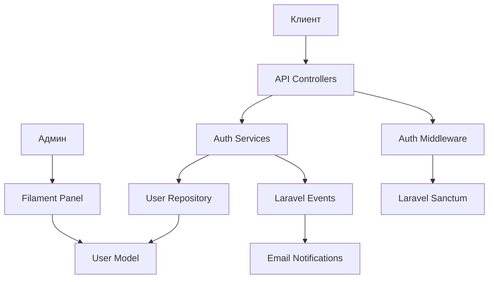

# Дизайн системы аутентификации

## Обзор

Система аутентификации построена на Laravel Sanctum для API токенов и стандартной аутентификации Laravel для веб-интерфейса. Архитектура следует принципам разделения ответственности с использованием сервисного слоя, репозиториев и строгой типизации.

## Архитектура

### Компоненты высокого уровня



### Слои архитектуры

1. **Presentation Layer**: API контроллеры и Filament панель
2. **Service Layer**: Бизнес-логика аутентификации
3. **Repository Layer**: Доступ к данным пользователей
4. **Model Layer**: Eloquent модели и отношения
5. **Infrastructure Layer**: Laravel Sanctum, события, уведомления

## Компоненты и интерфейсы

### API Контроллеры

#### RegisterController
```php
final class RegisterController extends ApiController
{
    public function __invoke(RegisterRequest $request): JsonResponse
    {
        // Регистрация через RegistrationService
        // Возврат UserResource с токеном
    }
}
```

#### LoginController
```php
final class LoginController extends ApiController
{
    public function __invoke(LoginRequest $request, LoginService $service): JsonResponse
    {
        // Аутентификация через LoginService
        // Создание API токена
        // Возврат пользователя и токена
    }
}
```

#### ForgotPasswordController
```php
final class ForgotPasswordController extends ApiController
{
    public function __invoke(ForgotPasswordRequest $request): JsonResponse
    {
        // Отправка ссылки сброса через ForgotPasswordService
    }
}
```

#### ResetPasswordController
```php
final class ResetPasswordController extends ApiController
{
    public function __invoke(ResetPasswordRequest $request): JsonResponse
    {
        // Сброс пароля через ResetPasswordService
    }
}
```

#### ChangePasswordController
```php
final class ChangePasswordController extends ApiController
{
    public function __invoke(ChangePasswordRequest $request): JsonResponse
    {
        // Смена пароля для аутентифицированного пользователя
    }
}
```

#### LogoutController
```php
final class LogoutController extends ApiController
{
    public function __invoke(LogoutService $service): JsonResponse
    {
        // Удаление текущего токена
    }
}
```

#### VerifyRegistrationController
```php
final class VerifyRegistrationController extends ApiController
{
    public function __invoke(User $user, string $hash): JsonResponse
    {
        // Верификация email через подписанную ссылку
    }
}
```

### Сервисы аутентификации

#### LoginService
```php
final readonly class LoginService
{
    public function attemptLogin(string $email, string $password): User
    {
        // Проверка учетных данных
        // Возврат аутентифицированного пользователя
        // Выброс ValidationException при неудаче
    }
}
```

#### RegistrationService
```php
final readonly class RegistrationService
{
    public function __construct(private UserRepository $userRepository) {}
    
    public function register(array $data): User
    {
        // Хеширование пароля
        // Создание пользователя через репозиторий
        // Отправка события Registered
    }
}
```

#### ForgotPasswordService
```php
final readonly class ForgotPasswordService
{
    public function sendResetLink(string $email): void
    {
        // Поиск пользователя по email
        // Генерация токена сброса
        // Отправка email с ссылкой
    }
}
```

#### ResetPasswordService
```php
final readonly class ResetPasswordService
{
    public function resetPassword(string $token, string $email, string $password): void
    {
        // Валидация токена сброса
        // Обновление пароля
        // Инвалидация токена
    }
}
```

#### ChangePasswordService
```php
final readonly class ChangePasswordService
{
    public function __construct(private UserRepository $userRepository) {}
    
    public function changePassword(User $user, string $currentPassword, string $newPassword): void
    {
        // Проверка текущего пароля
        if (!Hash::check($currentPassword, $user->password)) {
            throw ValidationException::withMessages([
                'current_password' => ['Неверный текущий пароль']
            ]);
        }
        
        // Обновление пароля
        $user->update(['password' => Hash::make($newPassword)]);
        
        // Инвалидация всех токенов для безопасности
        $user->tokens()->delete();
        
        // Отправка уведомления об изменении пароля
        $user->notify(new PasswordChangedNotification());
    }
}
```

#### LogoutService
```php
final readonly class LogoutService
{
    public function logout(User $user): void
    {
        // Удаление текущего токена
        // Логирование события выхода
    }
}
```

### Репозитории

#### UserRepository
```php
final readonly class UserRepository extends BaseRepository
{
    public function createWithVerification(array $data): User
    {
        // Создание пользователя
        // Установка email_verified_at в null
    }
    
    public function findByEmail(string $email): ?User
    {
        // Поиск пользователя по email
    }
    
    public function markEmailAsVerified(User $user): void
    {
        // Обновление email_verified_at
    }
}
```

## Модели данных

### User Model
```php
final class User extends Authenticatable implements HasName, MustVerifyEmail, FilamentUser
{
    use HasApiTokens, HasFactory, Notifiable;

    protected $fillable = [
        'is_admin', 'first_name', 'last_name', 'middle_name',
        'email', 'password', 'phone', 'address'
    ];

    protected $hidden = ['password', 'remember_token'];

    protected $casts = [
        'is_admin' => 'boolean',
        'email_verified_at' => 'datetime',
        'password' => 'hashed'
    ];
}
```

### API Resources

#### UserResource
```php
final class UserResource extends JsonResource
{
    public function toArray($request): array
    {
        return [
            'id' => $this->id,
            'first_name' => $this->first_name,
            'last_name' => $this->last_name,
            'middle_name' => $this->middle_name,
            'full_name' => $this->getName(),
            'email' => $this->email,
            'phone' => $this->phone,
            'address' => $this->address,
            'email_verified' => $this->email_verified_at !== null,
            'created_at' => $this->created_at,
            'updated_at' => $this->updated_at
        ];
    }
}
```

### Form Requests

#### RegisterRequest
```php
final class RegisterRequest extends ApiRequest
{
    public function rules(): array
    {
        return [
            'first_name' => ['required', 'string', 'max:255'],
            'last_name' => ['required', 'string', 'max:255'],
            'middle_name' => ['nullable', 'string', 'max:255'],
            'email' => ['required', 'email', 'unique:users,email', 'max:255'],
            'password' => ['required', 'string', 'min:8', 'confirmed'],
            'phone' => ['nullable', 'string', 'max:20'],
            'address' => ['nullable', 'string', 'max:500']
        ];
    }
}
```

#### LoginRequest
```php
final class LoginRequest extends ApiRequest
{
    public function rules(): array
    {
        return [
            'email' => ['required', 'email', 'max:255'],
            'password' => ['required', 'string', 'min:8', 'max:255']
        ];
    }
}
```

## Обработка ошибок

### Типы ошибок

1. **Validation Errors (422)**: Неверные входные данные
2. **Authentication Errors (401)**: Неверные учетные данные
3. **Authorization Errors (403)**: Недостаточно прав
4. **Not Found Errors (404)**: Пользователь не найден
5. **Rate Limit Errors (429)**: Превышен лимит запросов

### Обработка исключений

```php
// В LoginService
if (!Auth::attempt(['email' => $email, 'password' => $password])) {
    throw ValidationException::withMessages([
        'email' => [__('auth.failed')]
    ]);
}

// В ApiController
protected function errorResponse(string $message, int $code = 400): JsonResponse
{
    return response()->json([
        'status' => 'error',
        'message' => $message
    ], $code);
}
```

## Безопасность

### Меры безопасности

1. **Password Hashing**: Использование bcrypt через Laravel Hash для хеширования паролей
2. **Rate Limiting**: Ограничение попыток входа и регистрации (5 попыток в минуту)
3. **Token Security**: Laravel Sanctum для API токенов с автоматическим истечением неиспользуемых токенов
4. **Email Verification**: Подписанные ссылки для верификации с защитой от повторного использования
5. **CSRF Protection**: Автоматическая защита Laravel для веб-интерфейса
6. **Input Validation**: Строгая валидация всех входных данных с минимальными требованиями к паролю (8+ символов)
7. **HTTPS Enforcement**: Обязательное использование HTTPS для всех аутентификационных запросов
8. **Token Invalidation**: Автоматическая инвалидация всех токенов при смене пароля
9. **Logging**: Логирование всех аутентификационных событий для безопасности и аудита

### Конфигурация безопасности

```php
// config/auth.php
'guards' => [
    'web' => [
        'driver' => 'session',
        'provider' => 'users',
    ],
    'api' => [
        'driver' => 'sanctum',
        'provider' => 'users',
    ],
]

// Rate limiting в RouteServiceProvider
RateLimiter::for('auth', function (Request $request) {
    return Limit::perMinute(5)->by($request->ip());
});

// Middleware для API маршрутов
Route::middleware(['auth:sanctum'])->group(function () {
    // Защищенные маршруты
});

// Middleware для верификации email
Route::middleware(['auth:sanctum', 'verified'])->group(function () {
    // Маршруты, требующие подтвержденный email
});
```

## События и уведомления

### События

1. **Registered**: Отправляется при регистрации пользователя
2. **Login**: Отправляется при успешном входе
3. **PasswordReset**: Отправляется при сбросе пароля

### Уведомления

#### VerifyEmailNotification
```php
final class VerifyEmailNotification extends Notification
{
    public function via($notifiable): array
    {
        return ['mail'];
    }

    public function toMail($notifiable): MailMessage
    {
        return (new MailMessage)
            ->subject('Подтверждение email')
            ->line('Пожалуйста, подтвердите ваш email адрес')
            ->action('Подтвердить email', $this->verificationUrl($notifiable));
    }
}
```

#### ResetPasswordNotification
```php
final class ResetPasswordNotification extends Notification
{
    public function __construct(private string $token) {}

    public function toMail($notifiable): MailMessage
    {
        return (new MailMessage)
            ->subject('Сброс пароля')
            ->line('Вы получили это письмо, потому что мы получили запрос на сброс пароля')
            ->action('Сбросить пароль', url(config('app.frontend_url').'/reset-password/'.$this->token))
            ->line('Ссылка действительна в течение ограниченного времени');
    }
}
```

#### PasswordChangedNotification
```php
final class PasswordChangedNotification extends Notification
{
    public function toMail($notifiable): MailMessage
    {
        return (new MailMessage)
            ->subject('Пароль изменен')
            ->line('Ваш пароль был успешно изменен')
            ->line('Если это были не вы, немедленно свяжитесь с поддержкой')
            ->line('Все активные сессии были завершены для безопасности');
    }
}
```

## Интеграция с Filament

### Административный доступ

```php
// В User модели
public function canAccessPanel(Panel $panel): bool
{
    return $this->is_admin;
}

public function getFilamentName(): string
{
    return "{$this->last_name} {$this->first_name} {$this->middle_name}";
}
```

### Filament ресурсы

```php
final class UserResource extends Resource
{
    protected static ?string $model = User::class;
    protected static ?string $navigationIcon = 'heroicon-o-users';
    
    public static function form(Form $form): Form
    {
        return $form->schema([
            TextInput::make('first_name')->required(),
            TextInput::make('last_name')->required(),
            TextInput::make('email')->email()->required(),
            Toggle::make('is_admin'),
        ]);
    }
}
```

## Стратегия тестирования

### Типы тестов

1. **Unit Tests**: Тестирование сервисов и репозиториев
2. **Feature Tests**: Тестирование API эндпоинтов
3. **Integration Tests**: Тестирование взаимодействия компонентов

### Примеры тестов

```php
// Feature test для регистрации
public function test_user_can_register(): void
{
    $response = $this->postJson('/api/v1/register', [
        'first_name' => 'Иван',
        'last_name' => 'Иванов',
        'email' => 'test@example.com',
        'password' => 'password123',
        'password_confirmation' => 'password123'
    ]);

    $response->assertStatus(201)
        ->assertJsonStructure(['user', 'token']);
}

// Unit test для LoginService
public function test_login_service_authenticates_user(): void
{
    $user = User::factory()->create();
    $service = new LoginService();
    
    $authenticatedUser = $service->attemptLogin($user->email, 'password');
    
    $this->assertEquals($user->id, $authenticatedUser->id);
}
```

## Производительность

### Оптимизации

1. **Database Indexing**: Индексы на email и других часто используемых полях
2. **Token Cleanup**: Автоматическая очистка истекших токенов
3. **Rate Limiting**: Предотвращение злоупотреблений
4. **Caching**: Кеширование пользовательских данных при необходимости

### Мониторинг и логирование

1. **Laravel Telescope**: Для отладки в development окружении
2. **Authentication Logging**: Логирование всех аутентификационных событий
   - Успешные и неуспешные попытки входа
   - Регистрации новых пользователей
   - Смена паролей и выход из системы
   - Доступ к административной панели
3. **Security Metrics**: Отслеживание метрик безопасности
   - Количество попыток входа по IP
   - Частота запросов сброса пароля
   - Активность административных пользователей
4. **Error Tracking**: Мониторинг ошибок аутентификации
   - Rate limiting violations
   - Неверные токены верификации
   - Попытки несанкционированного доступа

### Примеры логирования

```php
// В LoginService
Log::info('User login attempt', [
    'email' => $email,
    'ip' => request()->ip(),
    'user_agent' => request()->userAgent()
]);

// В LogoutService
Log::info('User logged out', [
    'user_id' => $user->id,
    'ip' => request()->ip()
]);

// В административном доступе
Log::info('Admin panel access', [
    'user_id' => $user->id,
    'ip' => request()->ip(),
    'panel' => 'admin'
]);
```